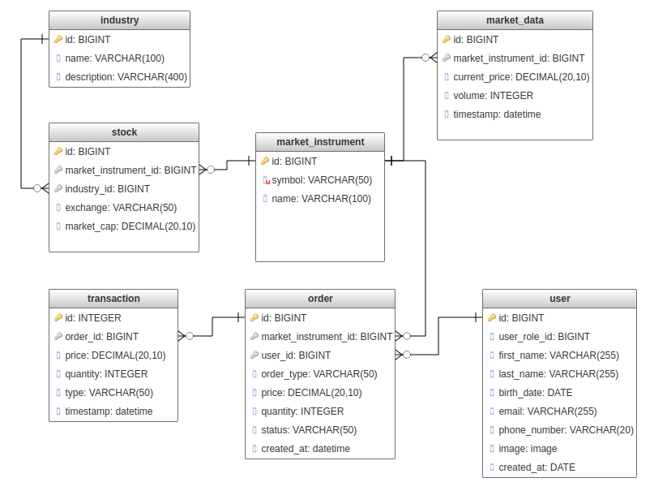

# Limit Order Book

**Home Assignment: Full Stack Developer Position**

---

**Objective:**

Develop a web application that simulates a stock market limit order book, using Django Framework. The application should allow users to add buy and sell orders for stocks, match orders where possible, and display the current state of the order book through both a UI and an API.

---

**Requirements:**

1. **Web UI**:
    - Design and implement a simple and clean interface.
    - Include fields for adding new stock orders (stock name, order type, price, quantity).
    - Display the current state of the order book, showing unmatched buy and sell orders.
    - Provide a section or page to view a history of all matched transactions.
2. **API**:
    - Design and Implement RESTful API endpoints for adding orders and retrieving the order book and transaction history.
3. **Data Model**:
    - Design models to store orders and transactions. The models should adhere to the rest of the requirements.
    
4. **Order Matching Logic**:
    - Implement the logic to match buy and sell orders based on price and quantity.
5. **Order Book Rules**:
    - Orders should be matched based on price; a buy order matches with the lowest sell order that is less than or equal to the buy price (and vice versa).
    - Implement basic order priority rules, such as first-come-first-served.
    - Orders with the same price should be matched in the order they were entered (time priority).
    - Partial order matching is allowed. If a buy order cannot be fully matched, it should be partially fulfilled with the available sell orders.
    - Unmatched orders remain in the order book until they are either matched or cancelled by the user.

---

**Optional Requirements**:

1. **Authentication**:
    - Implement a basic user registration and login system.
    - Ensure that each user can view only their order history and current orders.
2. **Enhanced UI**:
    - Develop a more advanced user interface using React/React-Native.
3. **Real-time Updates**:
    - Implement real-time updates in the UI as new orders are added or matched.
4. **Performance**:
    - Optimize the order matching algorithm and database queries for performance.

---

**Instructions**:

1. Use Django for the backend and a Relational Database.
2. Ensure that the application handles errors gracefully, displays appropriate messages for incorrect inputs or system errors.
3. Ensure that the code is modular, clean, and follows best practices.
4. Containerize your application using Docker for easy deployment and scalability.
5. Implement unit tests for critical components, especially the order matching logic.
6. Host your project on GitHub in a private repository and give access to the account ritual-company-dev, email: [ritual-dev@heyritual.com](mailto:ritual-dev@heyritual.com).

---

**Submission Guidelines**:

1. Share the link to the repository and ensure it's accessible to the provided email.
2. Include all the necessary instructions for setting up and running your project in the **`README.md`** file.
3. Ensure that all commits are well-structured and meaningful, showing the progression of your work.

---

**Evaluation Criteria**:

- **Functionality**: The application should fulfill all the primary requirements and work without errors.
- **Solution**: The solution to the problem will be evaluated.
- **Code Quality**: The code should be clean, well-organized, and adhere to best practices.
- **UI/UX**: The provided UI should be intuitive and user-friendly.
- **Testing**: Presence and quality of unit tests.
- **Documentation**: Clarity and completeness of the **`README.md`** and any additional documentation.

**Unimplemented LimitBook Class**:

```python
example.py
# This is a skeleton of the LimitBook class. Implement the missing functionalities. You can add more functions. Names are not critical - focus on functionality.

class LimitBook:
    def __init__(self):
        # TODO: Implement initialization logic

    def add_order(self, stock_name, order_type, price, quantity):
        # TODO: Implement order adding logic

    def match_orders(self):
        # TODO: Implement order matching logic

    def get_order_book(self):
        # TODO: Implement method to retrieve current state of order book

    def get_transaction_history(self):
        # TODO: Implement method to retrieve transaction history

```

### **Example**

1. **Buy Order**: Stock: AAPL, Price: $150, Quantity: 100
2. **Sell Order**: Stock: AAPL, Price: $155, Quantity: 50
3. **Sell Order**: Stock: AAPL, Price: $150, Quantity: 70

Order Book State After Each Order:

State After Order 1:

| Buy Orders (AAPL) | Sell Orders (AAPL) |
| --- | --- |
| 100 @ $150 | - |

*Comment*: First buy order added, no matching sell order.

State After Order 2:

| Buy Orders (AAPL) | Sell Orders (AAPL) |
| --- | --- |
| 100 @ $150 | 50 @ $155 |

*Comment*: Sell order added, no match as sell price is higher than buy price.

State After Order 3:

| Buy Orders (AAPL) | Sell Orders (AAPL) |
| --- | --- |
| 30 @ $150 | 50 @ $155 |

*Comment*: Sell order at $150 matches with buy order. 70 shares sold, 30 shares remaining in buy order.

**Explanation of Matches:**

- **Match in Order 3**: The sell order for 70 AAPL shares at $150 directly matches with the existing buy order for 100 shares at $150. As a result, 70 shares are sold, and the buy order is reduced to 30 shares. The sell order is fully executed and thus removed from the order book.
